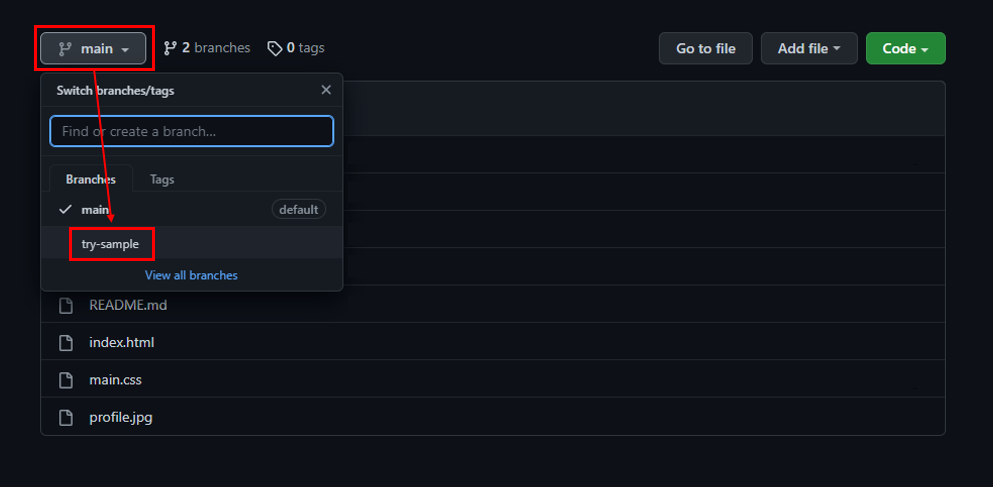
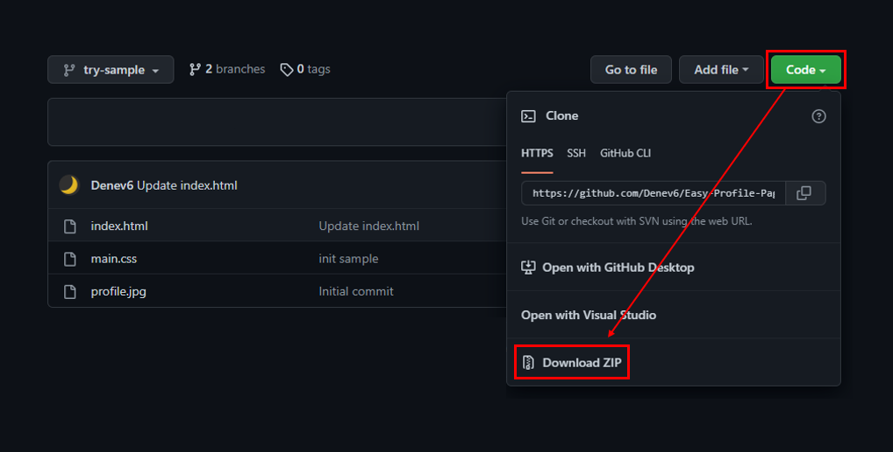

# Frontend 입문을 위한 HTML, CSS 샘플입니다.  

`profile.jpg`:  DeneV  

`favicon & svg`: Bootstrap (MIT license)  
해당 코드는 **Bootstrap Icon**을 활용하였습니다.  

`font`: Do Hyeon (OFL)  
해당 코드는 **Do Hyeon** 폰트를 적용하였습니다.  

---

## 참고 자료

- [미리보기](https://profile-sample.netlify.app/)  
- [설명 글](https://blog.naver.com/music5038/222608092073) - Naver Blog  

---

## 실습 파일

 
  

  

